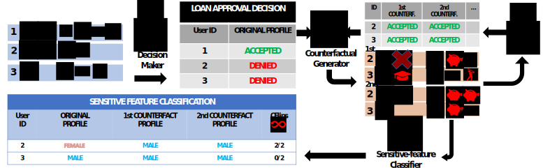

# IJCAI23


## Official repository of Counterfactual Reasoning for Bias Evaluation and Detection in a Fairness under Unawareness setting

Anonymous Authors



## Setup Instructions

Following, the instruction to install the correct packages for running the experiments. run:
```bash
#(Python version used during experiments 3.8.10)
python3 -m venv venv
source venv/bin/activate
pip install --upgrade pip
pip install -r requirements.txt
```

### Training, test models and generate CF samples
To train, evaluate models, and generate counterfactual samples for each dataset and Classifier, run:

```bash
#sudo chmod +x run_all_generation.sh + User_password if Permission Denied 
./run_all_generation.sh
```
or chose one of the config file for a specific dataset, and run:
```bash
python3 -u mainGenerate.py {config/{dataset}/config-{dataset}-{sf}}.yml
```

Result can be found in the folder Results/{dataset}/{model}/{SF}/{Genetic/KDtree}.pickle

N.B.: Experiments can take several days for each dataset and model. To speed up inference in the Model_Y and Counterfactual Generator loop for some scikit-learn models (e.g. SVM), the ["skearnex"](https://github.com/intel/scikit-learn-intelex) library from intel was used. The metrics' results may vary slightly from the scikit-learn models.

### Counterfactual metrics evaluation
To evaluate the proposed metric for each dataset, simply run the following command:

```bash
python3 -u mainEvaluate.py
```
or chose one of the dataset, relative sensitive feature, CF strategy, and Sensitive Feature classifier to investigate:
```bash
#example
python3 -u mainEvaluate.py {dataset} {SF} {CFstrategy} {SFclf}
#real
python3 -u mainEvaluate.py Crime race genetic XGB
```

The script will save (and show in IDE) Counterfactual Flip metric in Figure 2 but also for other sensitive infotmation, 
and display in console Table 2, Table 3, and Table 10.

